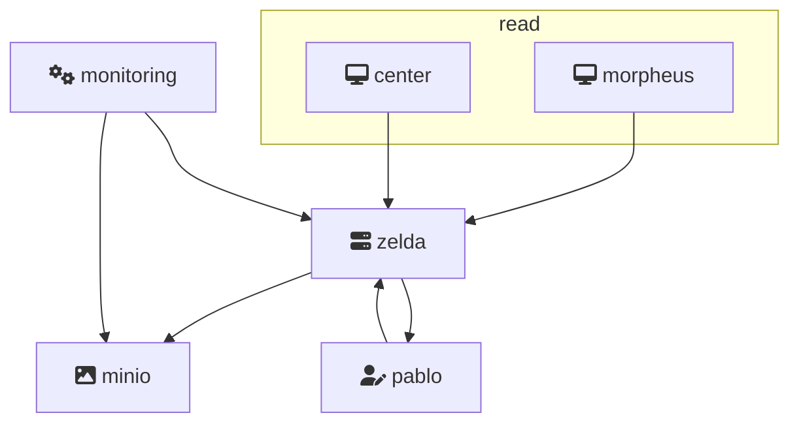

# Zelda API + Minio Browser

## Description


Zelda API is a standalone project that can be sused to serve all DNA products with assets that are shared, like:
- Reporting Space images
- Platform images
- *Less/CSS assets (coming soon)*

> Zelda's Ecosystem



### Zelda Documentation
[Swagger documentation](https://oni.datawhore.erratik.ca/documentation)

[Postman Collection](zelda.postman.json)

### Minio Browser
The Minio Browser is a UI that is accessible from the browser to manage buckets easily and do multiple uploads using drag and drop.
- accessKey: dna_admin
- secretKey: password

[Minio Browser Access](https://minio.datawhore.erratik.ca/minio)

---
---

### DOCKER + KUBERNETES

The image can be pulled using:
```bash
$ docker pull quay.ubisoft.com/dna/oni
```

> There is **no test or staging environment** for this project. When pushing to dev, it starts a **review/dev** app. Once merged to master, the **review/dev** environment should be [stopped](https://gitlab-ncsa.ubisoft.org/DNA/Web/oni/environments) manually to avoid unnecessarily polluting the cluster.

Some useful links:
- [docker image on quay](https://quay.ubisoft.com/repository/dna/oni)
- [review deployment](https://uks.ubisoft.com/k8s/clusters/c-rpg7w/api/v1/namespaces/kube-system/services/https:kubernetes-dashboard:/proxy/#!/deployment/review/oni-dev-v02nxn?namespace=review)
- [production pod](https://uks.ubisoft.com/k8s/clusters/c-rpg7w/api/v1/namespaces/kube-system/services/https:kubernetes-dashboard:/proxy/#!/deployment/production/oni?namespace=production)

---

## INSTALLATION

```bash
$ npm i
```

## Running the app
```bash
# development
$ npm run start:local

```

## Test

```bash
# unit tests
$ npm run test


# test coverage
$ npm run test:cov
```
